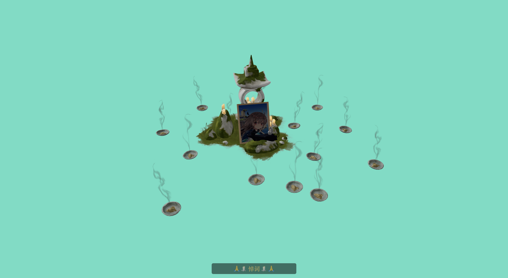
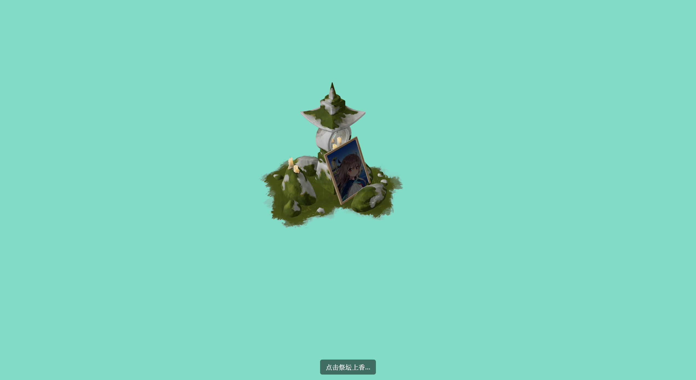

# Altar

<p align="center">
  
</p>

Altar 是一个基于 Tauri、Vue 3 和 TresJS 的 3D 祭坛桌面应用。它把可旋转的 3D 场景、上香交互、悼词输入和远程消息同步连接成一个安静的纪念空间。

用户点击祭坛后可以上香并输入悼词。提交后的悼词会同步到远程消息接口，并被渲染成场景里可点击的香灰对象；再次点击已点燃的祭坛时，会短暂显示隐藏角色，让整个祭拜过程有从进入、点燃到回看留言的完整反馈。

## 组件效果

<table>
  <tr>
    <td align="center" width="50%">
      
      <br />
      <strong>未上香状态</strong>
      <br />
      <sub>聚焦祭坛主体，底部提示引导用户点击祭坛上香。</sub>
    </td>
    <td align="center" width="50%">
      
      <br />
      <strong>上香后状态</strong>
      <br />
      <sub>悼词提交后生成环绕场景的香灰对象，并呈现可点击的纪念反馈。</sub>
    </td>
  </tr>
</table>

## 交互流程

1. 进入应用后加载祭坛主模型、蜡烛、相框与香灰资源。
2. 旋转视角观察场景，点击祭坛触发上香状态。
3. 输入悼词并提交，内容同步到远程消息接口。
4. 悼词列表会被映射成散落在场景中的香灰对象，点击香灰可查看对应内容。
5. 再次点击已点燃的祭坛，可短暂触发隐藏角色展示。

## 功能

- 3D 祭坛场景渲染，支持鼠标旋转视角
- Draco 压缩 GLB 模型加载
- 点击祭坛触发上香状态
- 输入悼词并提交到消息接口
- 根据悼词列表生成香灰对象，点击香灰查看对应内容
- 可作为 Web 页面运行，也可通过 Tauri 打包为桌面应用

## 技术栈

- Tauri 2
- Vue 3
- TypeScript
- Vite
- TresJS / Three.js
- Poisson Disk Sampling

## 项目结构

```text
.
├── public/
│   ├── draco/          # Draco 解码器文件
│   └── models/         # main.glb、ashes.glb 等 3D 模型
├── src/
│   ├── App.vue         # 主要交互与 3D 场景
│   └── main.ts         # Vue 入口
├── src-tauri/          # Tauri 桌面端配置与 Rust 入口
├── index.html
└── package.json
```

## 开发

安装依赖：

```bash
npm install
```

启动 Web 开发服务器：

```bash
npm run dev
```

启动 Tauri 桌面开发环境：

```bash
npm run tauri dev
```

构建前端：

```bash
npm run build
```

预览构建产物：

```bash
npm run preview
```

构建桌面应用：

```bash
npm run tauri build
```

## 资源约定

应用依赖以下静态资源路径：

- `/models/main.glb`：祭坛主模型
- `/models/ashes.glb`：香灰模型
- `/draco/`：Draco 解码器目录

如果模型或解码器不可访问，页面会在加载超时后提示检查资源路径。

## 消息接口

悼词消息通过 `https://aws.naroah.top/altar/messages` 读取和提交：

- `GET /messages`：读取悼词列表
- `POST /messages`：提交 `{ "content": "..." }`

接口不可用时，应用会继续显示本地交互，但远程消息不会同步。
